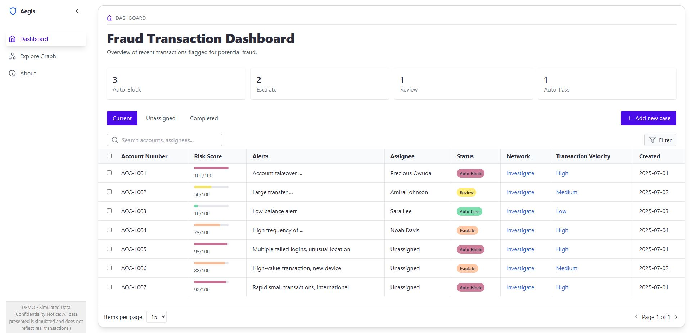
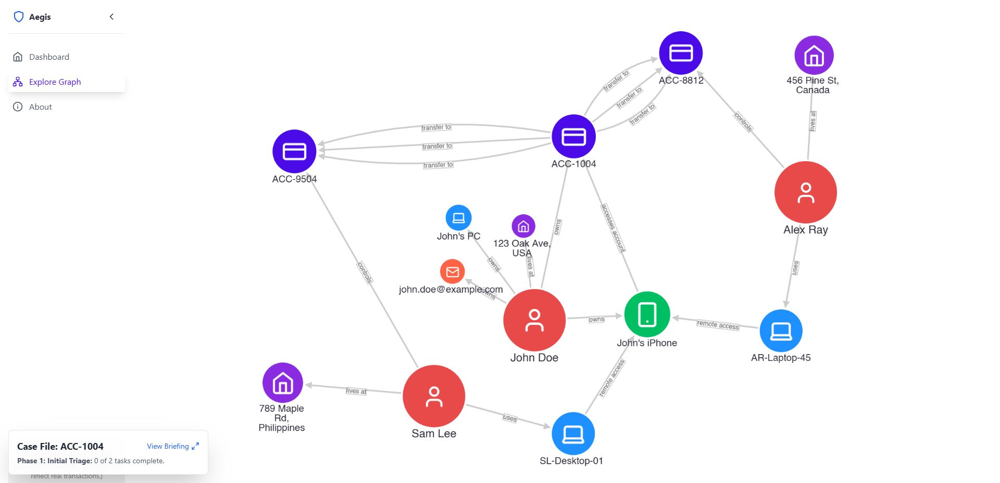
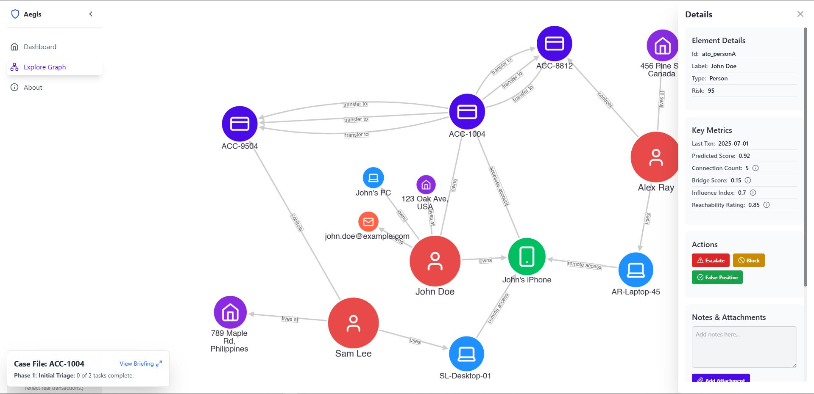
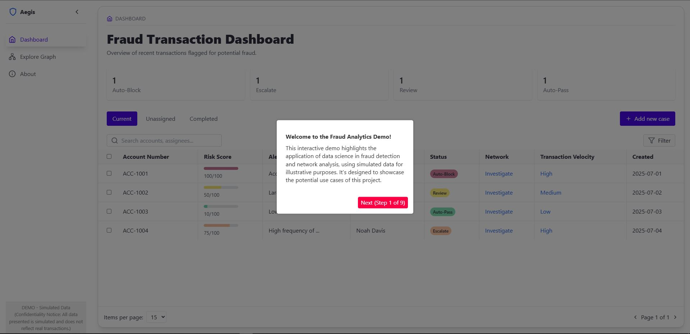
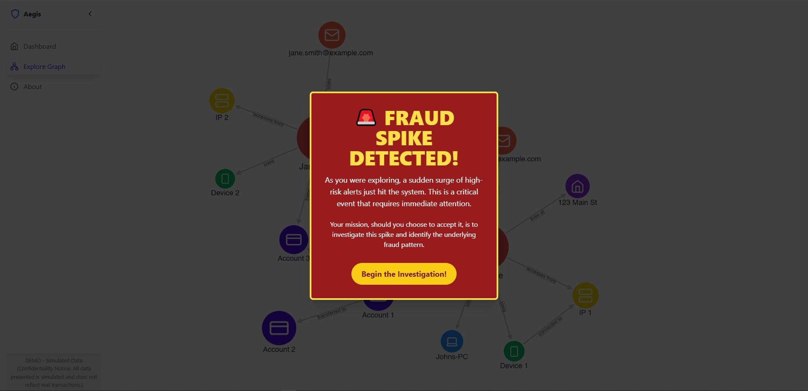

# Project Title: Risk Scoring and Network Mapping for Scalable Bank Fraud Detection

## Overview
This project developed a comprehensive and scalable bank fraud detection system designed to enhance the efficiency and accuracy of fraud identification. It integrates advanced analytical models with intuitive visualization tools to prioritize alerts and uncover complex fraud networks. This capstone project was developed in collaboration with a Data Scientist mentor from the financial industry, drawing insights from real-world banking challenges while focusing on a proof-of-concept for academic purposes.

## Problem Statement
Traditional methods of bank fraud detection often struggle with scalability, efficiency in human review, and the ability to identify sophisticated, interconnected fraud rings. There was a critical need for a system that could effectively balance high precision in automated blocking with optimized human review processes.

## Solution Approach
The solution employs a dual-model approach:
1.  **Fraud Scorecard Model:** Utilizes machine learning to assign risk scores to transactions, enabling high-confidence auto-blocking and intelligent prioritization of alerts for human review.
2.  **Interactive Network Analysis Dashboard:** Visualizes relationships between accounts and transactions, allowing analysts to quickly identify and investigate complex fraud clusters that are difficult to detect manually.

## Key Features & Innovations: Skills Demonstrated
These features highlight the core data science and engineering skills applied in this project:
*   **Dual-Model Fraud Detection:** Engineered a system that improved analyst efficiency by an estimated 4x by auto-blocking high-confidence fraud with 94% precision and prioritizing alerts.
*   **Optimized Data Processing:** Processed and refined a large dataset (400MB, 1.2 million accounts), reducing the feature set from 154 to 65 through rigorous EDA and feature engineering, resulting in an optimized 30MB dataset for modeling.
*   **Advanced Predictive Modeling:** Developed and implemented a fraud scorecard model using various machine learning algorithms (including XGBoost) to achieve 94% precision for auto-blocking and enable flexible optimization of recall versus operational costs.
*   **Intuitive Network Visualization:** Designed and built an interactive network analysis dashboard with Cytoscape.js, significantly reducing analyst cognitive load and enabling the visualization of complex fraud rings beyond typical manual review limitations.
*   **Streamlined User Interface:** Developed a responsive and intuitive user interface using React and Tailwind CSS, consolidating data from 3 disparate systems into a single, unified dashboard to streamline analyst workflows.
*   **Enhanced Data Accessibility:** Integrated key UI components (lucide-react, react-datepicker, recharts) to facilitate data input, date range selection, and visual data representation, improving data accessibility and interpretability.
*   **Accelerated Onboarding:** Incorporated a guided tour with react-joyride to accelerate user onboarding, illustrating the intended end-to-end workflow.

## Technologies Utilized
*   **Data Processing & Modeling:** Python, Logistic Regression, Gaussian Naive Bayes, Decision Tree Classifier, XGBoost
*   **Frontend & Visualization:** React, Tailwind CSS, Cytoscape.js, lucide-react, react-datepicker, recharts, react-joyride

## Impact & Results
The system significantly improved fraud detection capabilities by:
*   Achieving an estimated 4x improvement in analyst efficiency.
*   Enabling 94% precision for auto-blocking high-confidence fraud.
*   Reducing analyst cognitive load through intuitive network visualization.
*   Consolidating data from multiple systems into a single, unified view.

## Live Demo
Explore the interactive web application showcasing the fraud analytics system:
[https://aegis-fraud-analytics-showcase.vercel.app/](https://aegis-fraud-analytics-showcase.vercel.app/)
## Live Demo

Experience the interactive demo live here: [https://aegis-fraud-analytics-showcase.vercel.app/](https://aegis-fraud-analytics-showcase.vercel.app/)

Scan the QR code to access the live demo on your mobile device:

## Tech Stack

*   **Core Framework:** React
*   **Styling:** Tailwind CSS
*   **Graph Visualization:** Cytoscape.js
*   **UI Components:**
    *   `lucide-react` (icons)
    *   `react-datepicker` (date picker)
    *   `recharts` (charts)
*   **Guided Tour:** `react-joyride`
*   **Date Utilities:** `date-fns`

## Visual Showcase

Get a quick glimpse of the application's key features and user interface.

### Dashboard Overview

*A comprehensive view of fraud alerts and key metrics.*

### Interactive Network Graph

*Explore connections between entities to uncover fraudulent patterns.*

### Detail Side Pane

*Drill down into specific entity details and take action.*

### Guided Tutorials

*An interactive walkthrough of the application's features.*

*Step-by-step guidance through a simulated fraud investigation.*

## Data Science in Action

This demo showcases several applications of data science for fraud detection. While the front-end is a React application, the underlying data and metrics are derived from models and analyses that would be performed by a data science backend in a real-world scenario.

*   **Predictive Risk Scoring:** Each transaction in the dashboard is assigned a `Risk Score`. This score is the output of a machine learning model trained to identify transactions that resemble historical fraud patterns.
*   **Network Analysis Metrics:** The interactive graph is more than a visualization. The "Key Metrics" for each node (e.g., `Connection Count`, `Bridge Score`, `Influence Index`) are calculated using graph theory algorithms (like those in Python's `NetworkX` library). These metrics provide quantitative measures of an entity's influence and structural importance within the network, helping analysts quickly identify key players in a fraud ring.
*   **Behavioral Analytics:** Features like `Device Risk` and `Geo-Velocity` are derived from behavioral data. These analytics help detect anomalies such as a single device being associated with numerous accounts or logins occurring from geographically distant locations in an impossibly short time.

## Guided Tutorials

This demo features an interactive, game-like guided tutorial designed to onboard users and walk them through the core functionalities and a simulated fraud investigation scenario. Upon launching the application, you will be prompted to start the tutorial, which covers:

*   **Introduction to the Dashboard:** Familiarization with key metrics and alerts.
*   **Simulated Fraud Investigation:** A step-by-step walkthrough of an Account Takeover (ATO) scenario, demonstrating how to use the network graph and side pane to identify fraudulent activity.

## Confidentiality Notice
Due to the proprietary nature of the underlying dataset and specific implementation details, the project's code and raw data are confidential and cannot be publicly shared.

## For Developers
For technical details on the project structure, setup, and how to run the code, please see the [developer README here](./bank-fraud-detection-project/README.md).

## Future Directions

Building upon the current system, potential future enhancements for this project include:

*   **Real-time Streaming Data Integration:** Integrating real-time streaming data to enable immediate fraud detection.
*   **Advanced Anomaly Detection:** Exploring advanced deep learning models for more sophisticated anomaly detection.
*   **Expanded Fraud Typologies:** Expanding the system to cover additional fraud typologies and patterns.

## Research Paper / Methodology Document
A detailed methodology document (akin to a science paper) explaining the project's approach, challenges, and impact, without revealing confidential data or proprietary code, is currently being prepared and will be linked here once published. This document serves as a comprehensive overview for understanding the project's depth and your problem-solving skills.

## Contact
*   Email: amazonppc.mjosh@gmail.com
*   LinkedIn: https://www.linkedin.com/in/mljosh/
*   GitHub: https://github.com/mjoshua97241
